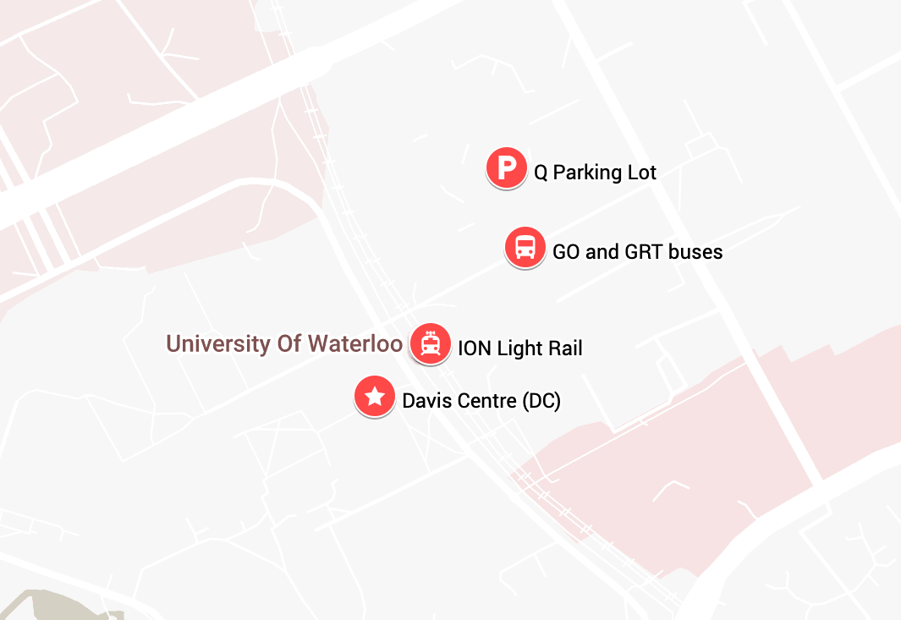

In the spirit of [Bay Area Crypto Day](https://sites.google.com/view/bayareacryptoday/), [NY Crypto Day](https://nycryptoday.wordpress.com/), and others, **Ontario Cryptography Day** aims to bring together the cryptography community in Ontario for a day of research talks and discussions. We hope to establish a recurring event rotating through universities in Ontario.

The event is open to academic, industry, and public sector researchers and practitioners in cryptography, but registration is required.



<h2 style="margin-top: 0em; border-color: #b8cbd1;">Program</h2>

The program will consist of technical talks, with coffee breaks and lunch.

The event will start at 10am and will end at approximately 4:30pm (end time to be confirmed).

<b>Invited keynote speaker:</b> <a href="https://web.eecs.umich.edu/~cpeikert/">Chris Peikert</a>, University of Michigan

<b>Speakers:</b>

<ul>
<li><a href="https://www.torontomu.ca/information-technology-management/faculty-research/atefeh-mashatan/">Atefeh Mashatan</a>, Toronto Metropolitan University</li>
<li><a href="https://www.connorpaddock.page/">Connor Paddock</a>, University of Ottawa</li>
<li><a href="https://mcpherrin.ca/">Matthew McPherrin</a>, Let's Encrypt</li>
<li><a href="https://rasoulam.github.io/">Rasoul Akhavan</a>, University of Waterloo</li>
<li><a href="https://vrasadi.com/">Vahid Reza Asadi</a>, University of Waterloo</li>
<li>To be announced</li>
</ul>

## Travel

**Parking:** The closest visitor parking to the Davis Centre is [Q Lot](https://maps.app.goo.gl/6innGRkyF9o33tRy5), which costs about $7/day and must be paid using the [AMP Mobile pay app](https://uwaterloo.ca/sustainable-transportation/visitors).

**Public transport:**

- [GO Transit](https://www.gotransit.com/en): Some GO Transit buses come directly to campus. For example, there is a GO train departing Toronto's Union Station at 7:34am to Bramalea which connects with a GO bus to the University of Waterloo campus, arriving at 9:50am. There are also GO trains to Kitchener station which connect with GRT buses/light rail from Kitchener to UW. Check the trip planner on the GO Transit website for more details.
- [Grand River Transit](https://www.grt.ca/en/): The ION light rail stops at the [University of Waterloo station](https://maps.app.goo.gl/pAdNsNZxX9tB7FN17). There are also many local buses that reach the University of Waterloo campus.

## Map

## Organizers

- [Mohammad Hajiabadi](https://sites.google.com/view/mdhajiabadi/home), University of Waterloo
- [Douglas Stebila](https://www.douglas.stebila.ca/research/), University of Waterloo

For more information, please email [dstebila@uwaterloo.ca](mailto:dstebila@uwaterloo.ca).

## Sponsors

Ontario Cryptography Day was made possible with the financial support of the [University of Waterloo's CryptoWorks21 program](https://uwaterloo.ca/cryptoworks/). Thanks to Sara Zafar Jafarzadeh, Michele Mosca, and Chin Heng Lee for their assistance.

