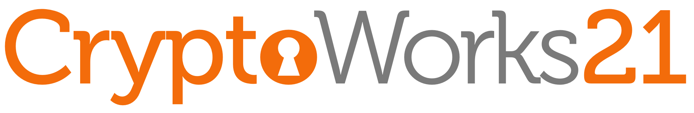

In the spirit of [Bay Area Crypto Day](https://sites.google.com/view/bayareacryptoday/), [NY Crypto Day](https://nycryptoday.wordpress.com/), [Charles River Crypto Day](https://bostoncryptoday.wordpress.com/), [Texas Crypto Day](https://texascryptoday.github.io/) and others, **Ontario Cryptography Day** aims to bring together the cryptography community in Ontario for a day of research talks and discussions. We hope to establish a recurring event rotating through universities in Ontario, Canada.

The event is open to academic, industry, and public sector researchers and practitioners in cryptography, but registration is required.



<h2 style="margin-top: 0em; border-color: #b8cbd1;">Program</h2>

<table style="font-size: 90%;">
<tr>
  <td>09:40–10:00</td>
  <td></td>
  <td>Registration</td>
  <td></td>
</tr>
<tr>
  <td>10:00–10:45</td>
  <td></td>
  <td><b><a target="_blank" href="https://romanlangrehr.github.io/">Roman Langrehr</a></b>, University of Waterloo</td>
  <td>When Are Pairings Necessary for Generic-Group Functional Encryption? 

Abstract
We show that private-key function-hiding inner-product functional encryption (FH-IPFE) is impossible in the generic group model (GGM). This impossibility extends to (non-compact) two-input quadratic functional encryption (QFE) under a weak security notion that allows only a single key corruption. Our results apply both to the variant where decryption outputs the result directly, and to the variant where the result is encoded in the exponent of a group element.Our results hold in both Maurer’s and Shoup’s model, with different tradeoffs. In Maurer’s model, we prove that FH-IPFE over Z_q^n cannot be realized even when q^n is polynomially bounded. This stands in sharp contrast to non-function-hiding FE, which can be constructed from minimal assumptions (one-way functions in the private-key setting and public-key encryption in the public-key setting) whenever the set of functions is polynomially bounded. We extend this impossibility to Shoup’s model when q^n is super-polynomial. Conceptually, our proof simulates any construction in Shoup’s model as one in Maurer’s model augmented with access to a random oracle.
Our techniques may be of independent interest, offering a general method for upgrading other impossibility results from Maurer’s model to Shoup’s model.The talk is based on a paper in submission to Eurocrypt 2026.
</td>
</tr>
<tr>
  <td>10:45–11:15</td>
  <td></td>
  <td>Coffee break</td>
  <td></td>
</tr>
<tr>
  <td>11:15–12:15</td>
  <td></td>
  <td>Invited keynote: <b><a target="_blank" href="https://elaineshi.com/">Elaine Shi</a></b>, Carnegie Mellon University</td>
  <td>Decentralized Mechanism Design 

Abstract
In classical auction design, we take it for granted that the auctioneer
is trusted and always implements the auction's rules honestly. This
assumption, however, no longer holds in modern auctions based on
blockchains, or those mediated by third-party platforms such as Google.
For example, in blockchain-based auctions, the consensus nodes that
partly serve as the auctioneer are incentivized to deviate from honest
behavior if profitable. Third-party auction platforms such as Google
have also been involved in high-profile anti-trust lawsuits for
manipulating their auctions.In this talk, I will describe our recent work on decentralized mechanism
design, where we aim to build a new scientific foundation for emerging
auctions that are not backed by a trusted auctioneer. I will
characterize the mathematical landscape of decentralized mechanism
design, by showing several infeasibility and feasibility results. I
will also highlight how cryptography can play an essential role for
bypassing impossibility results in decentralized mechanism design,
leading to a new class of auctions that not only incentivize bidders to
act honestly, but also incentivize the auctioneer to play by the book.
</td>
</tr>
<tr>
  <td>12:15–13:45</td>
  <td></td>
  <td>Lunch</td>
  <td></td>
</tr>
<tr>
  <td>13:45–14:30</td>
  <td></td>
  <td><b>Siddharth Agarwal</b>, University of Toronto</td>
  <td>Pseudorandom Correlated Function for Rate-1 Garbling

Abstract
The recent work of Liu, Wang, Yang, and Yu (EUROCRYPT 2025) introduced BitGC, a rate-1 garbling scheme for Boolean circuits where the size of the garbled circuit contains just 1 bit per gate. The scheme has modest evaluation costs (a constant number of homomorphic operations per gate) compared to other lattice-based succinct garbling schemes which rely on a non-black-box composition of fully homomorphic encryption and attribute-based encryption. Motivated by the goal of further compressing the garbled circuit while retaining the evaluation efficiency of BitGC, in this work, we introduce the notion of a pseudorandom correlation function (PCF) for garbling which effectively provides a compressed representation of the garbled circuit and its associated input labels. In a PCF for a garbling scheme, there are two correlated keys: a garbling key and an evaluation key. Using the garbling key, one can take any Boolean circuit and deterministically derive the associated garbled circuit. Conversely, using the evaluation key and the circuit , one can obtain the labels associated with the inputs to the circuit. Moreover, the size of the garbling key and the evaluation key depends only on the security parameter (independent of the size or depth of the circuit), and the same keys can be reused to derive garbled circuits and input encoding keys for any number of circuits. The main result in our work is a PCF for the BitGC garbling scheme from integer lattices.
</td>
</tr>
<tr>
  <td>14:30–15:15</td>
  <td></td>
  <td><b>Mojtaba Fadavi</b>, University of Waterloo</td>
  <td>Constructing Robust Threshold Signature Schemes: Classical vs. Post-Quantum Approaches

Abstract
A $(t,n)$-threshold signature scheme distributes a signing key among $n$ participants so that any set of $t$ or more can collaboratively produce a valid signature under a public key, while any set of fewer than $t$ cannot. These schemes fall into three categories: (i) "robust" schemes, which always produce a signature provided at least $t$ parties are honest; (ii) "identifiable-abort (IA)" schemes, which may fail to produce a signature but identify at least one misbehaving signer; and (iii) "simple" schemes, which guarantee neither robustness nor identifiable abort.In this talk, I will first review threshold signature schemes and these robustness notions. I will then discuss FORST as a practical IA threshold scheme, and ROAST as a generic technique for compiling IA threshold schemes into robust ones. Finally, I will briefly survey post-quantum lattice-based threshold signature schemes and outline the high-level idea behind a new robust threshold signature construction based on lattice assumptions.
</td>
</tr>
<tr>
  <td>15:15–15:45</td>
  <td></td>
  <td>Coffee break</td>
  <td></td>
</tr>
<tr>
  <td>15:45–16:30</td>
  <td></td>
  <td><b><a target="_blank" href="https://pps-lab.com/people/ashwinkarthikeyan/">Ashwin Karthikeyan</a></b>, University of Toronto</td>
  <td>Towards Practical Zero-Knowledge Proofs for PSPACE 

Abstract
Zero-knowledge (ZK) proofs have emerged as powerful tools for enabling secure and privacy-preserving computations. While practical ZK systems have achieved remarkable efficiency for problems in NP, their applicability beyond NP remains largely unexplored. In this talk, I will address that question by focusing on Quantified Boolean Formulas (QBFs)—a canonical PSPACE-complete problem that captures the complexity of many verification and strategic reasoning tasks. Existing ZK methods struggle to handle such problems efficiently.
I will present two new protocols that make zero-knowledge proofs for PSPACE practical: the first efficiently verifies the falsity of a QBF via quantified resolution, and the second enables proofs of knowledge of a winning strategy. Together, these protocols make it possible to construct zero-knowledge proofs for PSPACE-complete statements that were previously out of reach. This talk is based on work that will appear at IEEE Security & Privacy 2026.
</td>
</tr>
</table>

## Travel

**Public transport:** The Fields Institute is located a short walking distance from the Queen's Park TTC station.

**Parking:** There are a few paid parking spots at the intersection of Huron St. and College St.

## Map

<iframe src="https://www.google.com/maps/embed?pb=!1m18!1m12!1m3!1d2886.4924318361063!2d-79.39732219999999!3d43.6587275!2m3!1f0!2f0!3f0!3m2!1i1024!2i768!4f13.1!3m3!1m2!1s0x882b34c733f2e3d5%3A0x5360bf96152b850a!2sThe%20Fields%20Institute!5e0!3m2!1sen!2sca!4v1762615362887!5m2!1sen!2sca" width="600" height="450" style="border:0;" allowfullscreen="" loading="lazy" referrerpolicy="no-referrer-when-downgrade"></iframe>

## Organizers

- [Akshayaram Srinivasan](https://www.cs.toronto.edu/%7Eakshayaram/), University of Toronto

For more information, please email [akshayaram@cs.toronto.edu](mailto:akshayaram@cs.toronto.edu). 

We thank the Fields Institute for help with organization of this event. We thank [Ziyang Jin](https://www.cs.toronto.edu/~ziyang/) for volunteering in this event.


## Sponsors

Ontario Cryptography Day was made possible with the financial support of the [University of Waterloo's CryptoWorks21 program](https://uwaterloo.ca/cryptoworks/). Thanks to Sara Zafar Jafarzadeh, Michele Mosca, and Chin Heng Lee for their assistance.

We acknowledge the support of the Natural Sciences and Engineering Research Council of Canada (NSERC).




<h2 style="margin-top: 0em; border-width: 0px; font-size: 1.7em;">Upcoming events</h2>

The next Ontario Cryptography Day will take place in <b>Toronto in late November / early December, 2025</b>.

If you would like to be added to the email announcement list, please email <a href="mailto:dstebila@uwaterloo.ca">dstebila@uwaterloo.ca</a>.

We would be happy to have help from sponsors to be able to run Ontario Cryptography Day as a free event for attendees. Please reach out if you are interested in sponsoring.

## Past events

- [June 6, 2025 • University of Waterloo](/2025-06-06.html)


